# Relational Fraud Intelligence

Relational Fraud Intelligence is a dataset-first fraud triage platform for uploaded transaction data. It combines statistical analysis, behavioral pattern detection, persistent alerts, durable case management, reference scenario investigations, and operator-facing explanations without letting the explanation layer control the score.

---

## Table of contents

- [Why this project exists](#why-this-project-exists)
- [Workflow at a glance](#workflow-at-a-glance)
- [What the platform does](#what-the-platform-does)
- [Core concepts](#core-concepts)
- [Quick start](#quick-start)
- [Full container stack](#full-container-stack)
- [Daily operator workflow](#daily-operator-workflow)
- [Runtime modes](#runtime-modes)
- [Why this is a RelationalAI showcase](#why-this-is-a-relationalai-showcase)
- [RelationalAI mindset](#relationalai-mindset)
- [RelationalAI case study](#relationalai-case-study)
- [Architecture](#architecture)
- [Deployment topology](#deployment-topology)
- [Startup model](#startup-model)
- [Request and scoring model](#request-and-scoring-model)
- [Provider fallback model](#provider-fallback-model)
- [Persistence model](#persistence-model)
- [Workflows](#workflows)
- [Alert lifecycle](#alert-lifecycle)
- [Case lifecycle](#case-lifecycle)
- [Reference investigation workflow](#reference-investigation-workflow)
- [Evidence durability](#evidence-durability)
- [API surface](#api-surface)
- [Project structure](#project-structure)
- [Contributing](#contributing)
- [Quality gates](#quality-gates)
- [Security](#security)
- [License](#license)

---

## Why this project exists

Most fraud tools are either notebook-grade analysis sandboxes or workflow queues with weak evidence handling. This project joins the two:

- analysts can upload real transaction data and score it immediately
- risky analyses generate alerts automatically at a fixed threshold
- cases persist immutable evidence snapshots so historical context does not drift
- reference scenarios remain available for rule validation, graph testing, and demo flows

## Workflow at a glance

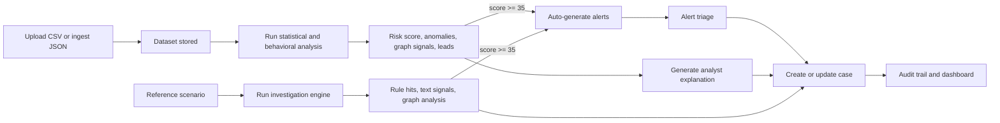

## What the platform does

- **Ingests transaction data** from CSV uploads or JSON API payloads.
- **Scores datasets** with Benford, outlier, velocity, round-amount, and behavioral analysis.
- **Generates alerts automatically** from the strongest findings when score `>= 35`.
- **Creates persistent cases** from datasets, alerts, or reference investigations.
- **Preserves historical evidence** by storing a case snapshot at creation time.
- **Supports deterministic and optional AI-assisted modes** with safe fallbacks.
- **Audits operator activity** and exposes runtime posture through `/health`.

## Core concepts

### Datasets

Datasets are the primary product entrypoint. A dataset stores uploaded transactions, analysis status, and the completed analysis payload.

### Alerts

Alerts are generated automatically from scenario investigations and dataset analyses when the score crosses the fixed threshold. Alerts are persistent workflow objects, not transient notifications.

### Cases

Cases are the durable investigation artifact. They track status, priority, assignment, comments, disposition, and an immutable evidence snapshot captured at creation time.

### Reference scenarios

Reference scenarios are seeded fraud stories used for validation, demo flows, graph analysis, and rule calibration. They are deliberately secondary to the dataset workflow.

### Explanation providers

The explanation layer helps operators understand results. It does not change risk scores, suppress alerts, or open cases.

---

## Quick start

1. Copy the environment template.

```bash
cp .env.example .env
```

2. Install backend and frontend dependencies.

```bash
python3 -m pip install -e ".[dev]"
npm --prefix frontend ci
```

3. Start Postgres and Redis.

```bash
docker compose up -d postgres redis
```

4. Apply migrations and seed the reference catalog.

```bash
rfi-manage migrate
rfi-manage seed
```

5. Start the backend and frontend.

```bash
rfi-api
npm --prefix frontend run dev
```

6. Open `http://localhost:3001`.

Bootstrap operators from `.env.example`:

- `analyst / AnalystPassword123!`
- `admin / AdminPassword123!`

## Full container stack

```bash
cp .env.example .env
docker compose up --build
```

The compose stack starts Postgres, Redis, the FastAPI backend, and the Next.js frontend. The backend container applies migrations before serving traffic. On startup the application can seed scenarios, bootstrap operators, prune expired audit events, and fall back from unavailable shared services or providers without failing the process.

## Daily operator workflow

1. Sign in as an analyst or admin.
2. Upload a transaction export or ingest transactions via API.
3. Run dataset analysis and inspect anomalies, graph signals, and investigation leads.
4. Review auto-generated alerts if the score crosses the alert threshold.
5. Open or update a case, assign it, add comments, and record disposition.
6. Use the dashboard and audit views to monitor throughput, queue pressure, and traceability.

## Runtime modes

| Mode | Key settings | Purpose |
|------|--------------|---------|
| Deterministic default | `RFI_TEXT_SIGNAL_PROVIDER=keyword`, `RFI_REASONING_PROVIDER=local-rule-engine`, `RFI_EXPLANATION_PROVIDER=deterministic` | Fully local, test-friendly baseline |
| Hugging Face assisted | `RFI_TEXT_SIGNAL_PROVIDER=huggingface`, `RFI_EXPLANATION_PROVIDER=huggingface` | Better text classification and richer operator explanations with deterministic fallback |
| RelationalAI reasoning | `RFI_REASONING_PROVIDER=relationalai` | Alternative reasoning engine behind the same application contract |

If an optional provider cannot start cleanly, the platform records the fallback in runtime notes and continues serving with deterministic defaults.

Run the product in dedicated RelationalAI showcase mode:

```bash
export RFI_REASONING_PROVIDER=relationalai
export RFI_RELATIONALAI_USE_EXTERNAL_CONFIG=false
export RFI_RELATIONALAI_DUCKDB_PATH=data/relationalai-showcase.duckdb
rfi-api
```

The investigation workspace will then expose `Hybrid RelationalAI` as the active reasoning provider whenever the relational adapter is contributing to the decision.

## Why this is a RelationalAI showcase

This repository is not using RelationalAI as a cosmetic add-on. It is structured to show the **mindset** behind relational reasoning in a production-shaped application:

- the product contract stays stable while the reasoning provider changes
- the system models **customers, accounts, devices, merchants, and money flow as connected facts**
- the RelationalAI path now builds an explicit **semantic fraud model** with concepts, relationships, derived rules, and a compiled metamodel summary
- the RelationalAI path produces investigation notes that explain **which graph motifs mattered**
- deterministic rules remain the operational baseline, so the showcase is credible rather than magical
- the UI surfaces the provider posture and the reasoning trace, so reviewers can see what RelationalAI changed

That combination makes the project useful as:

- a **showcase** for hybrid RelationalAI integration behind a real workflow
- a **case study** in turning fraud rows into relationship-first evidence
- a **mindset example** for keeping AI/reasoning providers behind clean application ports

## RelationalAI mindset

The core idea is simple: **fraud is usually not a row problem; it is a relationship problem**.

In this codebase, the RelationalAI path follows seven rules:

1. **Project facts, not just transactions.** The reasoner projects customers, accounts, devices, merchants, and relationship links so the scenario can be evaluated as a graph of interacting entities.
2. **Build a semantic model first.** The RelationalAI path declares concepts, properties, relationships, and derived fraud motifs before any workflow narrative is emitted.
3. **Ask structure-first questions.** The reasoning layer looks for circular flows, facilitator hubs, low-trust communities, and mule paths before it escalates workflow decisions.
4. **Compile locally, execute remotely when available.** The repository can compile the semantic fraud model into a RelationalAI metamodel offline, and can layer in external RelationalAI execution when runtime config is provided.
5. **Separate reasoning from workflow.** Alerts, cases, dashboards, and explanations do not depend on a specific provider implementation.
6. **Keep deterministic ground truth.** Local rules remain the baseline score so the RelationalAI path is an amplifier, not an excuse to hide logic.
7. **Explain the relational story.** Provider notes describe the projected facts, the semantic schema, the graph motifs, and the likely fraud archetype so the output reads like an investigation artifact.

## RelationalAI case study

### Cross-border shared-device mule ring

This repo is strongest when you read it as a worked example of a relational fraud problem:

1. Two or more customers transact through the same low-trust device.
2. Their accounts connect to overlapping merchants or transfer rails.
3. The graph exposes a path between accounts that would look harmless in isolated row-level review.
4. The RelationalAI path identifies the scenario as a **coordination ring**, a **mule corridor**, or a **central facilitator** pattern.
5. The product turns that reasoning into alerts, case creation, provider notes, and operator actions.

That is the intended showcase story: not "we called a library", but "we modeled the investigation as relationships, then used RelationalAI to explain why the network is suspicious."

The current hybrid implementation deliberately keeps the product runnable offline. It uses RelationalAI semantics for projection, semantic model construction, and metamodel compilation; preserves a deterministic local fallback; and makes the relational reasoning steps visible in the investigation result. That makes the repository practical for demos, code review, and architecture discussion without weakening the RelationalAI narrative.

### What the RelationalAI SDK is doing here

The RelationalAI integration is now explicit and first-class:

- `relationalai.config.Config` / `create_config` are imported directly
- `relationalai.semantics.Model` is used for both scenario projection and semantic fraud modeling
- the semantic layer declares concepts such as `Customer`, `Account`, `Device`, `Merchant`, and `Transaction`
- the model defines relationship facts and derived fraud motifs like shared low-trust device exposure and cross-border merchant exposure
- the repository compiles that semantic model into a RelationalAI metamodel locally, then surfaces the resulting schema and query catalog in investigation notes

When a full external RelationalAI runtime is configured, that same modeling posture is ready to back richer materialized queries instead of stopping at local compilation.

---

## Architecture

### System context

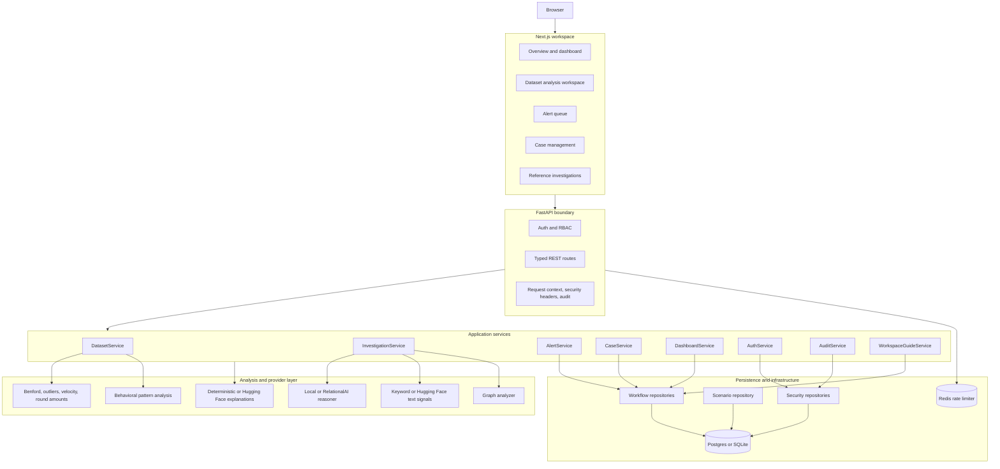

### Architectural intent

- The main workflow starts from uploaded transaction data, not canned scenarios.
- Reference scenarios are persistent seed data used for validation and controlled investigations.
- Scoring logic is deterministic by default and remains the source of truth.
- Optional AI integrations sit behind stable ports and fall back instead of taking the platform down.
- The RelationalAI path is intentionally hybrid: it projects relational facts, scores graph motifs, and leaves workflow orchestration unchanged.
- Alerts and cases are durable workflow state, not transient derived views.
- Cases persist an immutable evidence snapshot so historical investigations stay stable.

### Layer responsibilities

| Layer | Responsibility | Notes |
|------|----------------|-------|
| Next.js frontend | Operator workspace | Dashboard, dataset review, alerts, cases, reference investigations |
| FastAPI routes + middleware | HTTP contract | Auth, request context, security headers, audit logging |
| Application services | Workflow orchestration | Dataset analysis, investigations, alerts, cases, dashboard, auth |
| Infrastructure analysis | Scoring engines | Benford, outliers, velocity, round amounts, behavioral analysis, graph analysis |
| Provider adapters | Optional enrichment | Hugging Face text and explanations, RelationalAI reasoning |
| Repositories | Persistence boundary | SQLAlchemy-backed datasets, alerts, cases, audit, operators, scenarios |
| External services | Shared operational dependencies | Postgres/SQLite, Redis, optional Hugging Face, optional RelationalAI |

## Deployment topology

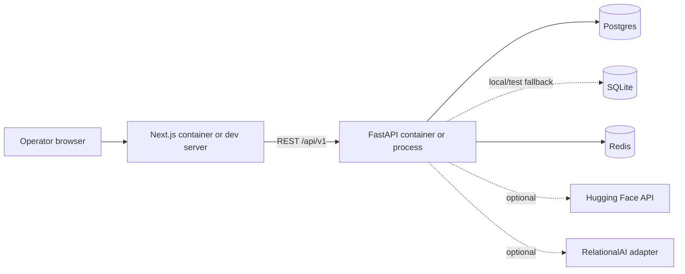

The normal local container baseline uses Postgres and Redis. Tests and lightweight runs can use SQLite and in-memory rate limiting.

## Startup model

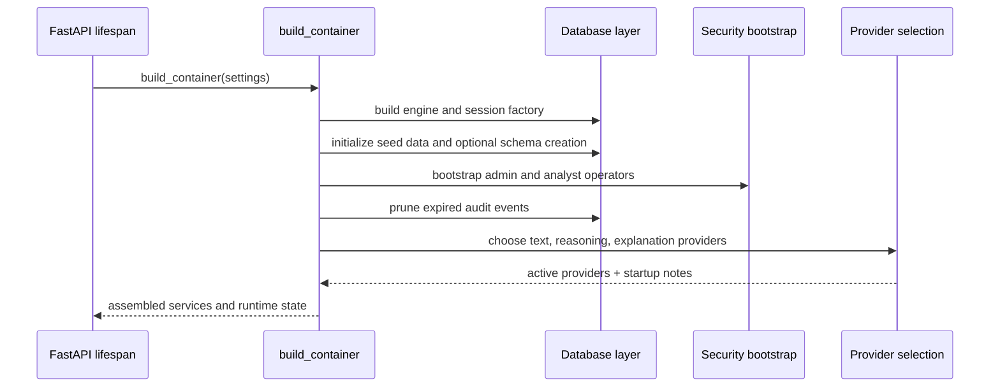

Important runtime properties:

- Migrations are applied explicitly through `rfi-manage migrate`.
- Scenario seeding can happen at startup if enabled.
- Redis rate limiting falls back to memory if Redis is unavailable.
- Hugging Face and RelationalAI integrations degrade gracefully through fallback wrappers.
- `/health` reports the resulting runtime posture.

## Request and scoring model

### Dataset analysis path

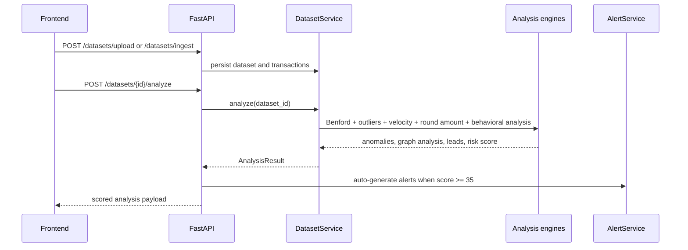

### Reference investigation path

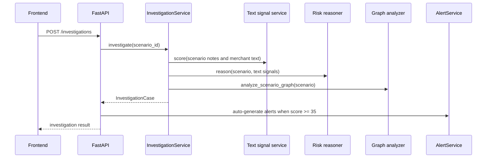

## Provider fallback model

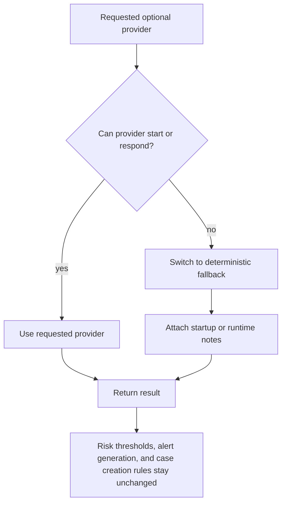

This design is deliberate. Providers may improve text interpretation or analyst-facing language, but they do not own the core workflow state machine.

## Persistence model

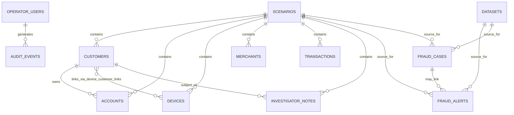

What is persisted:

- Scenario catalog and all related entities
- Operator users and audit events
- Uploaded datasets, raw uploaded transactions, and completed analysis JSON
- Fraud alerts
- Fraud cases, comment count, alert count, and immutable `evidence_snapshot`

What is derived at read time:

- Dashboard aggregates
- `/health` posture summaries
- Workflow guidance content

---

## Workflows

### Workflow map

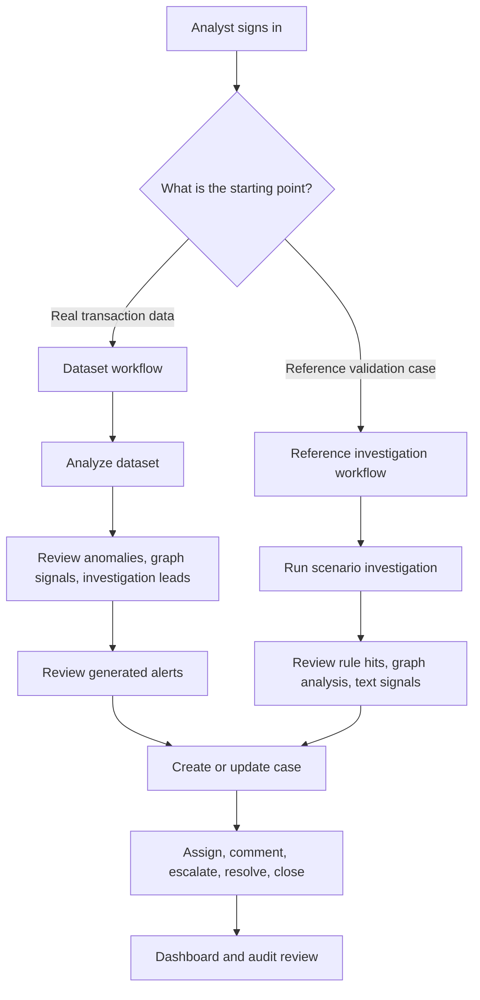

### Primary product workflow: dataset first

The normal operator journey starts with real transaction data.

**Step 1 — Ingest data.** Operators upload a CSV through `POST /datasets/upload` or ingest a JSON payload through `POST /datasets/ingest`. Each dataset persists metadata, normalized transactions, and status (`uploaded`, `analyzing`, `completed`, `failed`).

**Step 2 — Analyze the dataset.** `POST /datasets/{id}/analyze` runs Benford analysis, statistical outlier detection, velocity spike detection, round-amount detection, and behavioral analysis across accounts, merchants, devices, and geographies. The result includes an overall risk score, anomaly flags, graph analysis summary, investigation leads, and a human-readable summary.

**Step 3 — Alert generation.** If the resulting score is `>= 35`, the platform creates up to three alerts from the strongest findings for that dataset source.

**Step 4 — Create or update a case.** Analysts can open a case from a dataset analysis, an alert, a scenario investigation, or the generic `POST /cases` endpoint. The platform stores an evidence snapshot so later changes in rules or providers do not rewrite the historical case.

**Step 5 — Triage and disposition.** Cases and alerts move through their own lifecycle states while the dashboard and audit trail reflect the work.

### Dataset state model

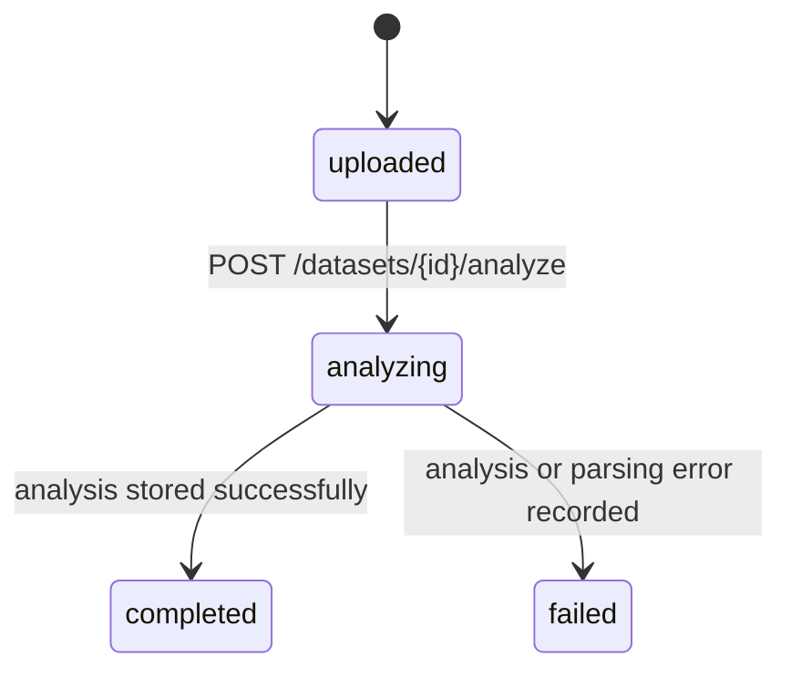

## Alert lifecycle

Alerts are persistent queue items. They can be linked to cases and reopened after terminal states.

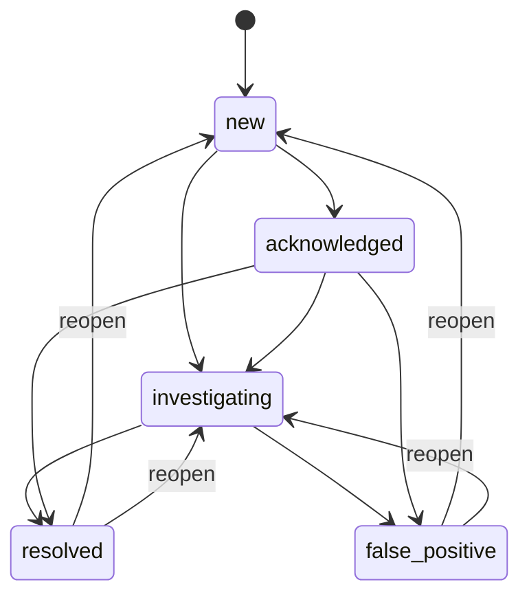

- `acknowledged_at` is set when an alert is first acknowledged.
- `resolved_at` is set when an alert reaches `resolved` or `false-positive`.
- Reopening clears stale terminal timestamps so status and timestamps stay consistent.

## Case lifecycle

Cases are the durable investigation record. Assignment can move an `open` case into `investigating`, and reopening clears resolution metadata.

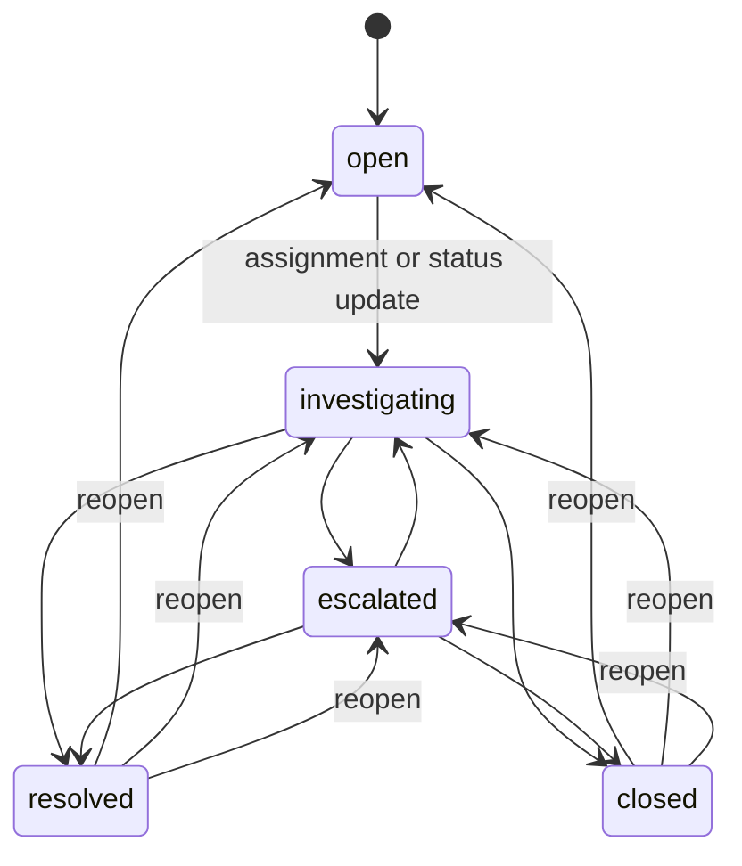

- `priority` defaults from risk level unless explicitly provided.
- High and critical cases get shorter SLA deadlines.
- Moving out of `resolved` or `closed` clears disposition, resolution notes, and `resolved_at`.
- Case comments increment a persisted `comment_count`.
- Linked alerts are tracked through a persisted `alert_count`.

## Reference investigation workflow

Reference scenarios are useful for rule validation, demos, graph testing, and deterministic fraud narratives. They are not the main data-entry path.

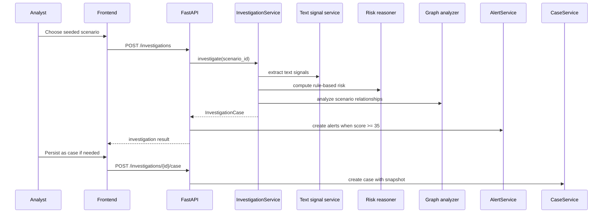

## Evidence durability

This is the project rule that protects historical integrity.

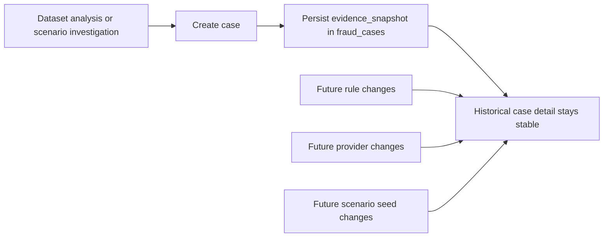

Without this rule, old cases would drift as the codebase evolved. The current implementation avoids that.

### Durable evidence rule

Case detail is intentionally audit-stable:

- Creating a case from a dataset stores the analysis-backed evidence snapshot.
- Creating a case from a scenario investigation stores the investigation-backed evidence snapshot.
- Later rule, provider, or seed-data changes do not rewrite that stored case evidence.

### Role-based view

| Role | Primary concern | Most used areas |
|------|-----------------|-----------------|
| Analyst | Turn risky data into a durable case quickly | datasets, alerts, cases |
| Queue owner | Keep alert backlog moving and close false positives fast | alerts, cases, dashboard |
| Admin | Verify platform health, traceability, and operator activity | dashboard, audit events, health |

---

## API surface

The API exposes 25 endpoints across these areas:

| Method | Path | Category | Purpose |
|--------|------|----------|---------|
| GET | `/health` | System | Health and runtime posture |
| POST | `/auth/token` | Authentication | Operator login |
| GET | `/auth/me` | Authentication | Current operator |
| GET | `/workspace/guide` | Dashboard | Workflow guidance |
| GET | `/dashboard/stats` | Dashboard | Aggregated workflow metrics |
| GET | `/scenarios` | Investigations | List reference scenarios |
| GET | `/scenarios/{id}` | Investigations | Scenario detail |
| POST | `/investigations` | Investigations | Run reference investigation |
| POST | `/investigations/{id}/case` | Investigations | Open case from investigation |
| POST | `/datasets/upload` | Datasets | Upload CSV |
| POST | `/datasets/ingest` | Datasets | Ingest JSON transactions |
| GET | `/datasets` | Datasets | List datasets |
| POST | `/datasets/{id}/analyze` | Datasets | Run analysis |
| GET | `/datasets/{id}/analysis` | Datasets | Read analysis |
| GET | `/datasets/{id}/explanation` | Datasets | Read operator explanation |
| POST | `/datasets/{id}/case` | Datasets | Open case from analysis |
| GET | `/alerts` | Alerts | List alerts |
| PATCH | `/alerts/{id}` | Alerts | Update alert status or linkage |
| POST | `/alerts/{id}/case` | Alerts | Open case from alert source |
| POST | `/cases` | Cases | Create case |
| GET | `/cases` | Cases | List cases |
| GET | `/cases/{id}` | Cases | Case detail |
| PATCH | `/cases/{id}/status` | Cases | Update case lifecycle |
| POST | `/cases/{id}/comments` | Cases | Add comment |
| GET | `/audit-events` | Admin | Read audit trail |

### Endpoints by workflow stage

| Stage | Endpoints | Outcome |
|------|-----------|---------|
| Authenticate | `POST /auth/token`, `GET /auth/me` | Establish operator session |
| Learn workflow | `GET /workspace/guide` | Fetch role-aware workflow guidance |
| Ingest data | `POST /datasets/upload`, `POST /datasets/ingest`, `GET /datasets` | Create and inspect datasets |
| Analyze data | `POST /datasets/{id}/analyze`, `GET /datasets/{id}/analysis`, `GET /datasets/{id}/explanation` | Score dataset and fetch explanation |
| Investigate scenarios | `GET /scenarios`, `GET /scenarios/{id}`, `POST /investigations` | Run reference investigation |
| Work alerts | `GET /alerts`, `PATCH /alerts/{id}`, `POST /alerts/{id}/case` | Triage alert queue and open cases |
| Work cases | `POST /cases`, `GET /cases`, `GET /cases/{id}`, `PATCH /cases/{id}/status`, `POST /cases/{id}/comments`, `POST /datasets/{id}/case`, `POST /investigations/{id}/case` | Create and manage durable investigations |
| Monitor platform | `GET /dashboard/stats`, `GET /audit-events`, `GET /health` | Observe queue health, audit trail, and runtime posture |

---

## API versioning strategy

All routes are served under a versioned prefix controlled by the `RFI_API_PREFIX`
setting (default: `/api/v1`).  The versioning policy is:

| Rule | Detail |
|------|--------|
| **Non-breaking additions stay in the current version** | New endpoints, new optional response fields, and new optional query parameters are added to `/api/v1` without bumping the version. |
| **Breaking changes get a new version prefix** | Renaming or removing a field, changing a field type, removing an endpoint, or altering auth semantics produces `/api/v2`. |
| **Deprecation window** | When `/api/v2` ships, `/api/v1` continues to be served for at least two release cycles with a `Sunset` response header. |
| **Contract of record** | `docs/openapi.json` is the single source of truth. The `openapi-check` CI job prevents accidental schema drift. |
| **Generated clients** | Frontend TypeScript types are generated from the OpenAPI schema via `make codegen-contracts`. They are not committed to git — CI regenerates them before every typecheck. |

### Migration checklist (when v2 is needed)

1. Create a new `api/v2/` router package alongside the existing `api/` routes.
2. Mount both routers in `app.py` under `/api/v1` and `/api/v2`.
3. Add `Sunset` and `Deprecation` headers to v1 responses via middleware.
4. Update `scripts/export_openapi.py` to export both versions.
5. After the deprecation window, remove the v1 router and redirect `/api/v1/*` → `/api/v2/*` with `301`.

---

## Project structure

```text
alembic/                               Alembic migrations
backend/                               Backend container build context
docs/sample_data/                      Sample transaction CSV for local testing
frontend/                              Next.js application
src/relational_fraud_intelligence/
  api/                                 FastAPI routes, middleware, dependencies
  application/                         DTOs, ports, and services
  domain/                              Pydantic domain models
  infrastructure/                      Persistence, analysis, security, providers
tests/                                 Backend unit and API tests
.github/workflows/                     CI and CD automation
```

---

## Contributing

### Prerequisites

- Python 3.11+
- Node.js 22+
- Docker & Docker Compose (for the full container stack)

### Development setup

```bash
# Clone the repository
git clone <repo-url> && cd relational-AI

# Copy the env template
cp .env.example .env

# Install backend (with dev extras) and frontend
make install

# Install pre-commit hooks
make precommit-install
```

### Running locally

Start the backend and frontend in separate terminals:

```bash
# Terminal 1 — backend
rfi-api

# Terminal 2 — frontend
npm --prefix frontend run dev
```

Or bring up the full stack with Docker:

```bash
docker compose up --build
```

### Writing a pull request

1. Create a feature branch from `main`.
2. Keep commits focused — one logical change per commit.
3. Write or update tests for any new behavior.
4. Run `make quality` before pushing.
5. Open a PR with a clear title and description of _what_ changed and _why_.

### Adding a database migration

```bash
# After changing domain models or table definitions:
rfi-manage migrate   # applies existing migrations
# Then create a new Alembic revision manually in alembic/versions/
```

Follow the existing naming convention: `YYYYMMDD_NNNN_description.py`.

### Code style

- **Backend**: enforced by [Ruff](https://docs.astral.sh/ruff/) (line length 100, Python 3.11 target). Import order and formatting are automatic.
- **Frontend**: TypeScript strict mode. Prefer explicit types over `any`.
- **Commits**: use imperative mood ("Add feature" not "Added feature").

## Quality gates

Every pull request must pass:

```bash
make quality          # runs all checks below in sequence
```

Individual checks:

| Command | What it does |
|---------|--------------|
| `make lint` | Ruff lint on backend source, tests, and migrations |
| `make format` | Ruff auto-format |
| `make mypy` | Strict type checking for the backend |
| `make test` | Backend pytest suite with coverage enforcement (≥ 85%) |
| `make typecheck` | Frontend TypeScript type checking |
| `make frontend-test` | Frontend Vitest component tests |
| `make frontend-build` | Production Next.js build |
| `pre-commit run --all-files` | Full pre-commit hook sweep |

CI validates:

- Pre-commit on the full repository
- Backend lint, strict typing, tests, and coverage
- Frontend typecheck, component tests, and production build
- Migration and runtime smoke tests with Postgres and Redis
- Backend and frontend Docker image builds

---

## Security

### Reporting a vulnerability

If you discover a security vulnerability, **do not open a public GitHub issue**. Report it privately by emailing the maintainers or using GitHub's [private vulnerability reporting](https://docs.github.com/en/code-security/security-advisories/guidance-on-reporting-and-writing-information-about-vulnerabilities/privately-reporting-a-security-vulnerability) feature on this repository.

Include:

- A description of the vulnerability and its impact.
- Steps to reproduce or a proof of concept.
- The version or commit hash where you found the issue.

We will acknowledge receipt within 48 hours and aim to provide a fix or mitigation plan within 7 days.

### Supported versions

| Version | Supported |
|---------|-----------|
| 1.0.x   | ✅ Active |
| < 1.0   | ❌ No     |

### Security design highlights

**Authentication & authorization**

- Operators authenticate via JWT tokens issued by `/api/v1/auth/token`.
- Tokens are signed with `HS256` using `RFI_JWT_SECRET`, which **must** be at least 32 characters and must be rotated outside `local` and `test` environments.
- Bootstrap operator passwords must be at least 12 characters.
- Routes enforce role-based access: `analyst` and `admin` roles gate different capabilities.

**Rate limiting**

- Login and general API traffic are rate-limited independently.
- Rate limiting supports in-memory and Redis backends with automatic fallback.

**Audit trail**

- Every request receives a unique `X-Request-ID` and is logged to the audit table.
- Audit retention is configurable via `RFI_AUDIT_LOG_RETENTION_DAYS` (default: 90).
- The `rfi-manage prune-audit` command removes expired events.

**Request security**

- CORS origins are explicitly configured via `RFI_CORS_ALLOWED_ORIGINS`.
- Security headers are applied by the `SecurityHeadersMiddleware`.
- Cases persist immutable evidence snapshots so later rule or provider changes do not rewrite historical context.

**Provider isolation**

- Optional AI integrations (Hugging Face, RelationalAI) sit behind stable application ports.
- If a provider fails at startup, the platform records the fallback and continues with deterministic defaults — it never exposes raw provider errors to operators.

### Production configuration checklist

| Setting | Requirement |
|---------|-------------|
| `RFI_JWT_SECRET` | ≥ 32 characters, rotated outside local/test |
| `RFI_BOOTSTRAP_ADMIN_PASSWORD` | ≥ 12 characters |
| `RFI_BOOTSTRAP_ANALYST_PASSWORD` | ≥ 12 characters |
| `RFI_APP_ENV` | Set to `production` (blocks default JWT secret) |
| `RFI_CORS_ALLOWED_ORIGINS` | Restrict to your actual frontend origin |
| `RFI_RATE_LIMIT_BACKEND` | `redis` recommended for multi-instance deployments |

### Management commands

- `rfi-manage create-operator` — creates named operators for managed environments.
- `rfi-manage prune-audit` — deletes expired audit events on demand.

---

## Design rules worth preserving

- Keep scoring deterministic and explainable by default.
- Keep optional providers behind explicit interfaces and fallbacks.
- Treat alerts and cases as workflow state, not cache.
- Preserve historical evidence with stored snapshots.
- Keep dataset analysis as the primary product flow.
- Alert thresholds stay fixed regardless of provider mode.
- The explanation layer never decides workflow state on its own.

---

## License

This project is licensed under the [MIT License](LICENSE).
