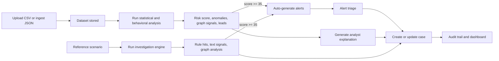

# Relational Fraud Intelligence

Relational Fraud Intelligence is a dataset-first fraud triage platform for uploaded transaction data. It combines statistical analysis, behavioral pattern detection, persistent alerts, durable case management, reference scenario investigations, and operator-facing explanations without letting the explanation layer control the score.

## Why this project exists

Most fraud tools are either notebook-grade analysis sandboxes or workflow queues with weak evidence handling. This project joins the two:

- analysts can upload real transaction data and score it immediately
- risky analyses generate alerts automatically at a fixed threshold
- cases persist immutable evidence snapshots so historical context does not drift
- reference scenarios remain available for rule validation, graph testing, and demo flows

## Workflow at a glance



## What the platform does

- **Ingests transaction data** from CSV uploads or JSON API payloads.
- **Scores datasets** with Benford, outlier, velocity, round-amount, and behavioral analysis.
- **Generates alerts automatically** from the strongest findings when score `>= 35`.
- **Creates persistent cases** from datasets, alerts, or reference investigations.
- **Preserves historical evidence** by storing a case snapshot at creation time.
- **Supports deterministic and optional AI-assisted modes** with safe fallbacks.
- **Audits operator activity** and exposes runtime posture through `/health`.

## Documentation map

- [README.md](README.md): product overview, quick start, and repo map
- [docs/workflows.md](docs/workflows.md): end-to-end operator workflows and lifecycle diagrams
- [docs/architecture.md](docs/architecture.md): system architecture, deployment, persistence, and runtime model
- [docs/sample_data/sample_transactions.csv](docs/sample_data/sample_transactions.csv): example dataset for local testing

## Core concepts

### Datasets

Datasets are the primary product entrypoint. A dataset stores uploaded transactions, analysis status, and the completed analysis payload.

### Alerts

Alerts are generated automatically from scenario investigations and dataset analyses when the score crosses the fixed threshold. Alerts are persistent workflow objects, not transient notifications.

### Cases

Cases are the durable investigation artifact. They track status, priority, assignment, comments, disposition, and an immutable evidence snapshot captured at creation time.

### Reference scenarios

Reference scenarios are seeded fraud stories used for validation, demo flows, graph analysis, and rule calibration. They are deliberately secondary to the dataset workflow.

### Explanation providers

The explanation layer helps operators understand results. It does not change risk scores, suppress alerts, or open cases.

## Quick start

1. Copy the environment template.

```bash
cp .env.example .env
```

2. Install backend and frontend dependencies.

```bash
python3 -m pip install -e ".[dev]"
npm --prefix frontend ci
```

3. Start Postgres and Redis.

```bash
docker compose up -d postgres redis
```

4. Apply migrations and seed the reference catalog.

```bash
rfi-manage migrate
rfi-manage seed
```

5. Start the backend and frontend.

```bash
rfi-api
npm --prefix frontend run dev
```

6. Open `http://localhost:3001`.

Bootstrap operators from `.env.example`:

- `analyst / AnalystPassword123!`
- `admin / AdminPassword123!`

## Full container stack

```bash
cp .env.example .env
docker compose up --build
```

The compose stack starts Postgres, Redis, the FastAPI backend, and the Next.js frontend. The backend container applies migrations before serving traffic. On startup the application can seed scenarios, bootstrap operators, prune expired audit events, and fall back from unavailable shared services or providers without failing the process.

## Daily operator workflow

1. Sign in as an analyst or admin.
2. Upload a transaction export or ingest transactions via API.
3. Run dataset analysis and inspect anomalies, graph signals, and investigation leads.
4. Review auto-generated alerts if the score crosses the alert threshold.
5. Open or update a case, assign it, add comments, and record disposition.
6. Use the dashboard and audit views to monitor throughput, queue pressure, and traceability.

The deep-dive version of this flow, including lifecycle diagrams, lives in [docs/workflows.md](docs/workflows.md).

## Runtime modes

| Mode | Key settings | Purpose |
|------|--------------|---------|
| Deterministic default | `RFI_TEXT_SIGNAL_PROVIDER=keyword`, `RFI_REASONING_PROVIDER=local-rule-engine`, `RFI_EXPLANATION_PROVIDER=deterministic` | Fully local, test-friendly baseline |
| Hugging Face assisted | `RFI_TEXT_SIGNAL_PROVIDER=huggingface`, `RFI_EXPLANATION_PROVIDER=huggingface` | Better text classification and richer operator explanations with deterministic fallback |
| RelationalAI reasoning | `RFI_REASONING_PROVIDER=relationalai` | Alternative reasoning engine behind the same application contract |

If an optional provider cannot start cleanly, the platform records the fallback in runtime notes and continues serving with deterministic defaults.

## Security and operations

- `RFI_JWT_SECRET` must be rotated outside local/test and must be at least 32 characters.
- Bootstrap operator passwords must be at least 12 characters.
- Login and general API traffic are rate-limited independently.
- Every request receives an `X-Request-ID` and is written to the audit trail.
- Cases persist evidence snapshots so later rule or provider changes do not rewrite historical case context.
- Audit retention is controlled by `RFI_AUDIT_LOG_RETENTION_DAYS`.
- `rfi-manage create-operator` creates named operators for managed environments.
- `rfi-manage prune-audit` deletes expired audit events on demand.

## Quality and delivery

Local quality commands:

```bash
make lint
make mypy
make test
make typecheck
make frontend-test
make frontend-build
make quality
pre-commit run --all-files
```

CI validates:

- pre-commit on the full repository
- backend lint, strict typing, tests, and coverage
- frontend typecheck, component tests, and production build
- migration and runtime smoke tests with Postgres and Redis
- backend and frontend Docker image builds

## API surface summary

The API currently exposes 25 endpoints across these areas:

- system health
- authentication
- workspace guidance and dashboard stats
- reference scenario investigations
- datasets upload, ingest, analysis, explanation, and case creation
- alerts listing, triage, and case creation
- cases listing, detail, status, and comments
- admin audit access

The full endpoint map is documented in [docs/architecture.md](docs/architecture.md) and [docs/workflows.md](docs/workflows.md).

## Project structure

```text
alembic/                               Alembic migrations
backend/                               Backend container build context
docs/                                  Architecture, workflows, sample data
frontend/                              Next.js application
src/relational_fraud_intelligence/
  api/                                 FastAPI routes, middleware, dependencies
  application/                         DTOs, ports, and services
  domain/                              Pydantic domain models
  infrastructure/                      Persistence, analysis, security, providers
tests/                                 Backend unit and API tests
.github/workflows/                     CI and CD automation
```

## Where to read next

- Read [docs/workflows.md](docs/workflows.md) if you want to understand how analysts move from data to case.
- Read [docs/architecture.md](docs/architecture.md) if you want the system, deployment, and persistence view.

## License

This project is licensed under the [MIT License](LICENSE).
