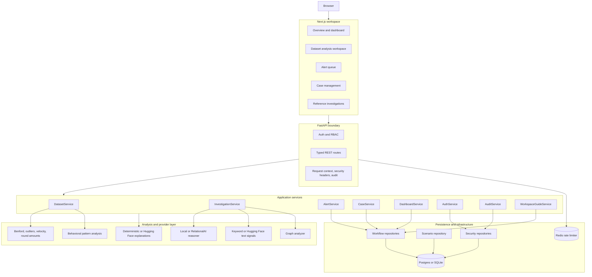
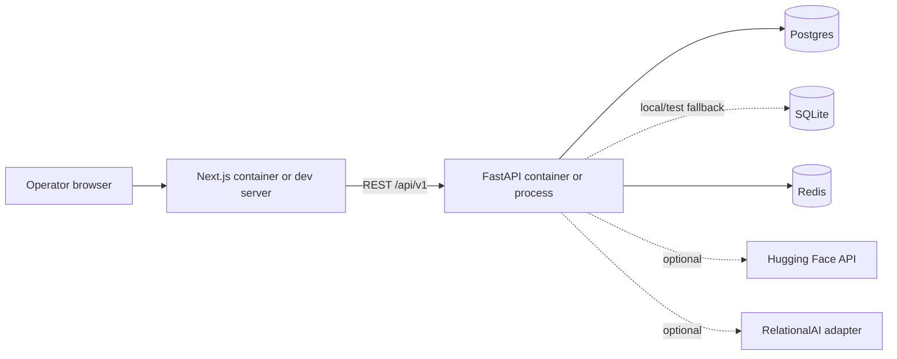
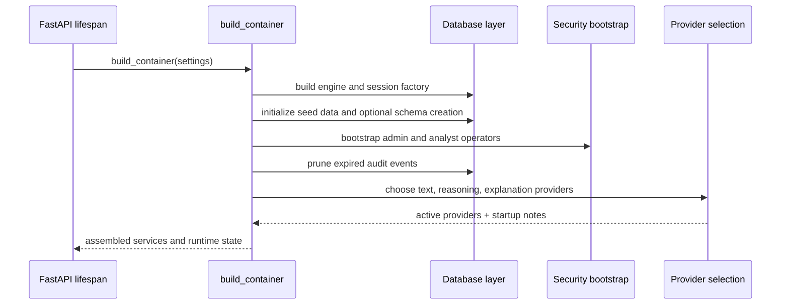
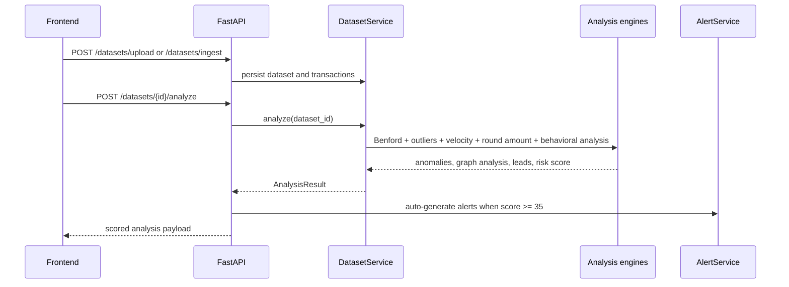
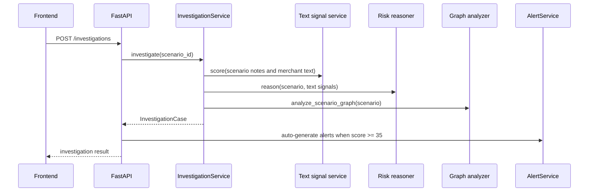
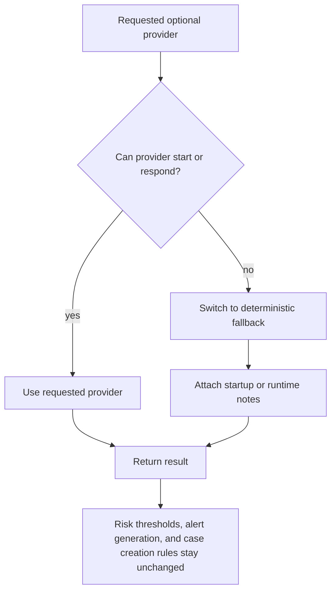
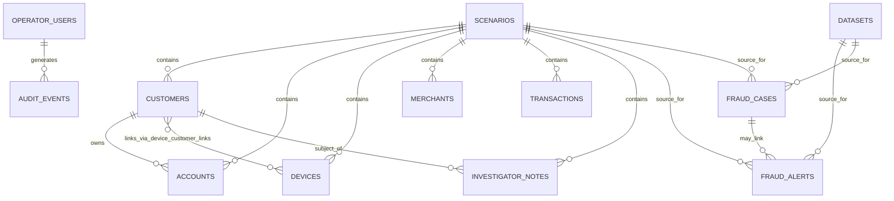

# Architecture

This document explains how Relational Fraud Intelligence is wired: which layers exist, how requests move through them, what gets persisted, and how the runtime degrades safely when optional dependencies fail.

For operator-facing flows and lifecycle diagrams, read [workflows.md](workflows.md).

## System context

## Architectural intent

- The main workflow starts from uploaded transaction data, not canned scenarios.
- Reference scenarios are persistent seed data used for validation and controlled investigations.
- Scoring logic is deterministic by default and remains the source of truth.
- Optional AI integrations sit behind stable ports and fall back instead of taking the platform down.
- Alerts and cases are durable workflow state, not transient derived views.
- Cases persist an immutable evidence snapshot so historical investigations stay stable.

## Layer responsibilities

| Layer | Responsibility | Notes |
|------|----------------|-------|
| Next.js frontend | Operator workspace | Dashboard, dataset review, alerts, cases, reference investigations |
| FastAPI routes + middleware | HTTP contract | Auth, request context, security headers, audit logging |
| Application services | Workflow orchestration | Dataset analysis, investigations, alerts, cases, dashboard, auth |
| Infrastructure analysis | Scoring engines | Benford, outliers, velocity, round amounts, behavioral analysis, graph analysis |
| Provider adapters | Optional enrichment | Hugging Face text and explanations, RelationalAI reasoning |
| Repositories | Persistence boundary | SQLAlchemy-backed datasets, alerts, cases, audit, operators, scenarios |
| External services | Shared operational dependencies | Postgres/SQLite, Redis, optional Hugging Face, optional RelationalAI |

## Deployment topology

The normal local container baseline uses Postgres and Redis. Tests and lightweight runs can use SQLite and in-memory rate limiting.

## Startup model

Important runtime properties:

- migrations are applied explicitly through `rfi-manage migrate`
- scenario seeding can happen at startup if enabled
- Redis rate limiting falls back to memory if Redis is unavailable
- Hugging Face and RelationalAI integrations degrade gracefully through fallback wrappers
- `/health` reports the resulting runtime posture

## Request and scoring model

### Dataset analysis path

### Reference investigation path

## Provider fallback model

This design is deliberate. Providers may improve text interpretation or analyst-facing language, but they do not own the core workflow state machine.

## Persistence model

What is persisted:

- scenario catalog and all related entities
- operator users and audit events
- uploaded datasets, raw uploaded transactions, and completed analysis JSON
- fraud alerts
- fraud cases, comment count, alert count, and immutable `evidence_snapshot`

What is derived at read time:

- dashboard aggregates
- `/health` posture summaries
- workflow guidance content

## Durable evidence rule

Case detail is intentionally audit-stable:

- creating a case from a dataset stores the analysis-backed evidence snapshot
- creating a case from a scenario investigation stores the investigation-backed evidence snapshot
- later rule, provider, or seed-data changes do not rewrite that stored case evidence

That decision is one of the most important workflow guarantees in the project.

## API surface

| Method | Path | Category | Purpose |
|--------|------|----------|---------|
| GET | `/health` | System | Health and runtime posture |
| POST | `/auth/token` | Authentication | Operator login |
| GET | `/auth/me` | Authentication | Current operator |
| GET | `/workspace/guide` | Dashboard | Workflow guidance |
| GET | `/dashboard/stats` | Dashboard | Aggregated workflow metrics |
| GET | `/scenarios` | Investigations | List reference scenarios |
| GET | `/scenarios/{id}` | Investigations | Scenario detail |
| POST | `/investigations` | Investigations | Run reference investigation |
| POST | `/investigations/{id}/case` | Investigations | Open case from investigation |
| POST | `/datasets/upload` | Datasets | Upload CSV |
| POST | `/datasets/ingest` | Datasets | Ingest JSON transactions |
| GET | `/datasets` | Datasets | List datasets |
| POST | `/datasets/{id}/analyze` | Datasets | Run analysis |
| GET | `/datasets/{id}/analysis` | Datasets | Read analysis |
| GET | `/datasets/{id}/explanation` | Datasets | Read operator explanation |
| POST | `/datasets/{id}/case` | Datasets | Open case from analysis |
| GET | `/alerts` | Alerts | List alerts |
| PATCH | `/alerts/{id}` | Alerts | Update alert status or linkage |
| POST | `/alerts/{id}/case` | Alerts | Open case from alert source |
| POST | `/cases` | Cases | Create case |
| GET | `/cases` | Cases | List cases |
| GET | `/cases/{id}` | Cases | Case detail |
| PATCH | `/cases/{id}/status` | Cases | Update case lifecycle |
| POST | `/cases/{id}/comments` | Cases | Add comment |
| GET | `/audit-events` | Admin | Read audit trail |

## Design rules worth preserving

- Keep scoring deterministic and explainable by default.
- Keep optional providers behind explicit interfaces and fallbacks.
- Treat alerts and cases as workflow state, not cache.
- Preserve historical evidence with stored snapshots.
- Keep dataset analysis as the primary product flow.
