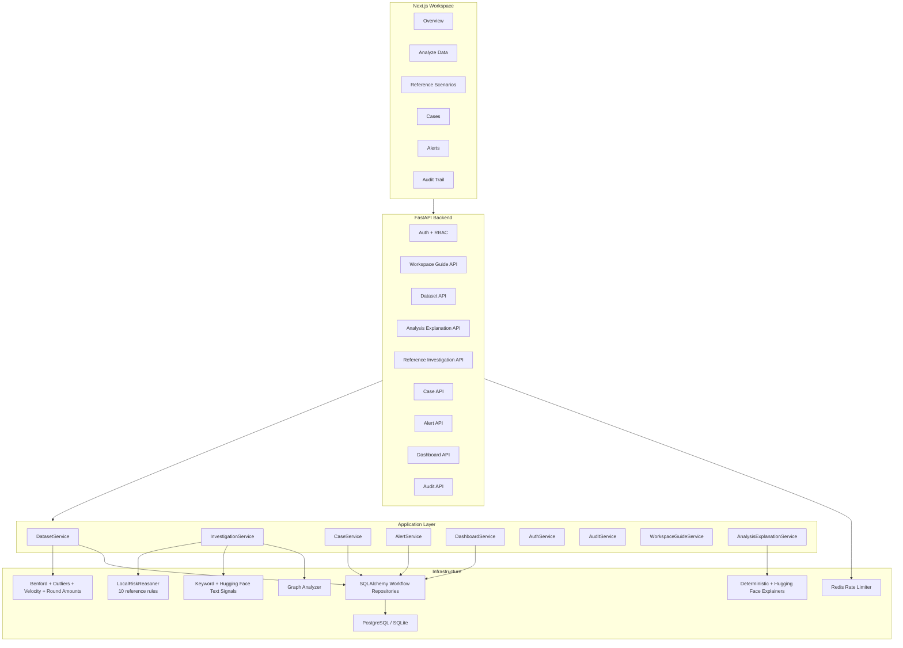
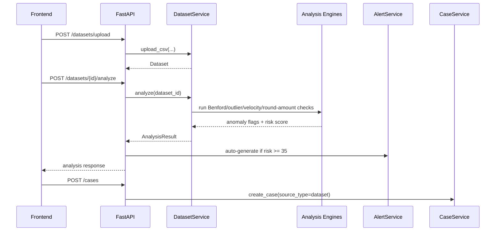
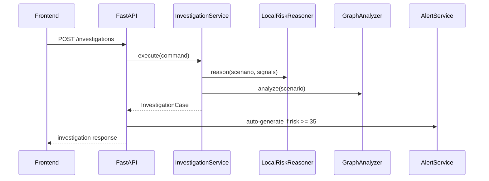

# Architecture

## System overview

Relational Fraud Intelligence is a dataset-first fraud triage workspace.
Analysts authenticate, upload transaction data, run statistical analysis,
triage auto-generated alerts, manage persistent cases, and use reference
scenario investigations for validation and rule calibration.

## Core principles

- The real product flow starts from uploaded transaction data.
- Alerts, cases, and datasets are persisted through SQLAlchemy repositories.
- Cases capture immutable evidence snapshots at creation time so historical reviews do not drift when rules or providers change.
- Reference scenarios exist for validation, tests, and rule calibration, not as the primary user workflow.
- Provider failures are surfaced as runtime notes instead of collapsing the whole flow.
- Authentication, rate limiting, and audit logging are part of the application boundary, not bolt-ons.

## Main patterns

- **Repository pattern**: scenario, workflow, and security repositories are isolated behind application-facing contracts.
- **Strategy pattern**: text-signal and reasoning providers support deterministic defaults with optional fallbacks.
- **Service layer**: dataset ingestion, investigations, alerts, cases, dashboard stats, auth, and audit all live in explicit services.
- **Ports and adapters**: application contracts stay stable while infrastructure swaps persistence or provider implementations.

## Dataset analysis flow

## Reference investigation flow

## Persistence model

Relational storage with SQLAlchemy + Alembic:

- `scenarios`, `customers`, `accounts`, `devices`, `device_customer_links`, `merchants`, `transactions`, `investigator_notes`
- `operator_users`, `audit_events`
- `datasets`
- `fraud_alerts`
- `fraud_cases`

Datasets persist uploaded rows and analysis payloads. Alerts and cases persist
source metadata, and cases additionally persist source evidence snapshots so
historical details remain stable for datasets and reference scenarios alike.

## API surface

| Method | Path | Tag | Description |
|--------|------|-----|-------------|
| GET | `/health` | System | Platform health check |
| POST | `/auth/token` | Authentication | Operator login |
| GET | `/auth/me` | Authentication | Current operator profile |
| GET | `/workspace/guide` | Dashboard | Primary workflow and role guide |
| GET | `/scenarios` | Investigations | List reference scenarios |
| GET | `/scenarios/{id}` | Investigations | Scenario details |
| POST | `/investigations` | Investigations | Run reference investigation |
| POST | `/investigations/{id}/case` | Investigations | Create and persist a case from a scenario investigation |
| POST | `/datasets/upload` | Datasets | Upload a transaction CSV |
| POST | `/datasets/ingest` | Datasets | Ingest transactions via API |
| GET | `/datasets` | Datasets | List uploaded datasets |
| POST | `/datasets/{id}/analyze` | Datasets | Analyze uploaded data |
| GET | `/datasets/{id}/analysis` | Datasets | Fetch analysis results |
| POST | `/datasets/{id}/case` | Datasets | Create and persist a case from a completed analysis |
| GET | `/datasets/{id}/explanation` | Datasets | Fetch operator-facing analysis brief |
| POST | `/cases` | Cases | Create fraud case |
| GET | `/cases` | Cases | List cases |
| GET | `/cases/{id}` | Cases | Case details |
| PATCH | `/cases/{id}/status` | Cases | Update case status |
| POST | `/cases/{id}/comments` | Cases | Add case comment |
| GET | `/alerts` | Alerts | List alerts |
| PATCH | `/alerts/{id}` | Alerts | Update alert status |
| POST | `/alerts/{id}/case` | Alerts | Create and persist a case from an alert source |
| GET | `/dashboard/stats` | Dashboard | Aggregate workflow metrics |
| GET | `/audit-events` | Admin | Audit trail |

## Operational model

- Alembic owns schema evolution.
- `rfi-manage migrate` applies workflow and security migrations.
- `rfi-manage seed` loads the reference scenario catalog if empty.
- Redis-backed rate limiting protects authentication and API traffic.
- `/health` exposes the active text, reasoning, and explanation provider posture.
- Dashboard activity is built from persisted datasets, alerts, and cases rather than synthetic counters.

## RelationalAI integration

`RelationalAIRiskReasoner` remains isolated behind the same reasoning contract as
the local rule engine. That keeps the dataset workflow stable while preserving a
clear seam for deeper semantic reasoning on the reference investigation side.
