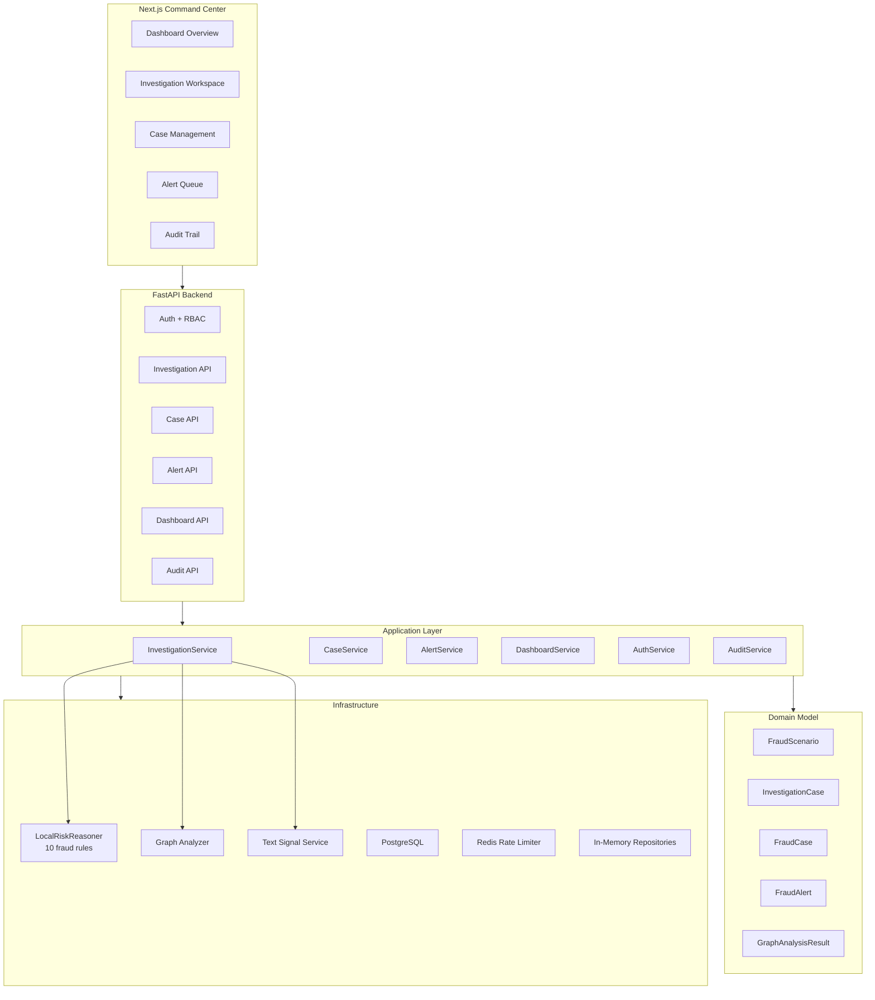
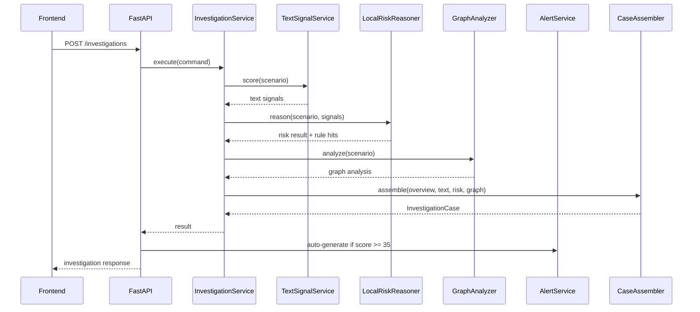
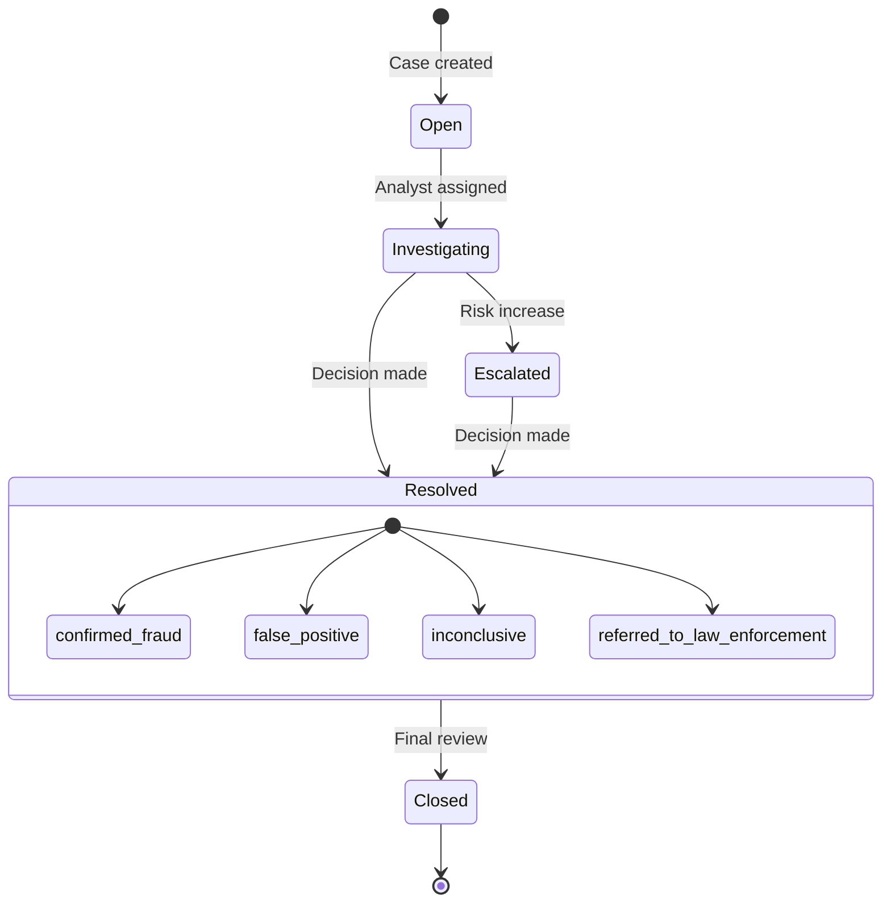
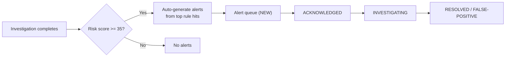

# Architecture

## System overview

Relational Fraud Intelligence is a production-grade fraud investigation platform.
Analysts authenticate, investigate seeded fraud scenarios through a rule-based
reasoning engine, manage persistent fraud cases, triage auto-generated alerts,
and monitor platform health — all through a typed FastAPI backend and a Next.js
command center.

## Core principles

- All application boundaries use Pydantic objects (DTOs, domain models, commands, results).
- Domain logic is separated from vendor integrations and transport concerns.
- Data is persisted through SQLAlchemy repositories, migrated through Alembic, and run primarily on Postgres.
- Provider failures are explicit and surfaced to the UI through runtime notes.
- The UI consumes one stable investigation contract regardless of active providers.
- Authentication, rate limiting, and audit logging are treated as first-class application concerns.
- Case and alert management provide a real operational workflow beyond read-only investigation.

## Main patterns

- **Repository pattern**: `ScenarioRepository`, `CaseRepository`, `AlertRepository` backed by infrastructure implementations
- **Strategy pattern**: text-signal and risk-reasoner providers with fallback wrappers
- **Rule object pattern**: the local risk engine composes 10 individual fraud rules
- **Ports and adapters**: application owns contracts, infrastructure owns implementations
- **Service layer**: authentication, audit, case lifecycle, and alert management
- **Assembler pattern**: `InvestigationCaseAssembler` builds the product-facing result
- **Graph analysis**: relationship network analysis computes structural risk amplifiers

## Investigation flow

## Case lifecycle

## Alert pipeline

## Fraud rule engine

The `LocalRiskReasoner` composes 10 independent fraud detection rules:

| Rule | Code | Weight | Detection |
|------|------|--------|-----------|
| Shared Device Cluster | `shared-device-cluster` | 28 | Multiple customers on same low-trust device |
| Rapid Spend Burst | `rapid-spend-burst` | 18 | High-value transactions within 10-minute window |
| Textual Fraud Context | `textual-fraud-context` | ≤18 | NLP/keyword signals from notes and merchants |
| High-Risk Merchant | `high-risk-merchant-concentration` | 16 | Volume concentrated in digital goods, crypto, gift cards |
| Velocity Anomaly | `velocity-anomaly` | 14 | 3+ transactions within 30-minute window |
| Cross-Border Mismatch | `cross-border-mismatch` | 12 | Merchant country differs from customer country |
| Dormant Account | `dormant-account-activation` | 12 | Low-balance accounts with sudden high-value activity |
| Round Amount | `round-amount-structuring` | 10 | High ratio of exact round-amount transactions |
| Historical Risk | `historical-risk-pressure` | 8 | Chargeback or manual review history |
| ATO Investigator Context | (contextual) | 0 | Adds investigator note graph links for ATO scenarios |

Rules produce `RuleHit` objects with weight, narrative, and evidence references. The total risk score is capped at 100.

## Graph analysis engine

The graph analyzer builds an entity relationship network from scenario data:

- **Nodes**: customers, accounts, devices, merchants
- **Edges**: owns (customer→account), uses (customer→device), transacts-with (customer→merchant)

Computed metrics:
- Connected components and graph density
- Hub entity detection (nodes with degree > mean + 1 std dev)
- Community detection (via networkx when available)
- Risk amplification factor: `1.0 + (density × 0.5) + (hub_count × 0.1)`, capped at 2.0×

## Persistence model

Relational storage with SQLAlchemy + Alembic:

- `scenarios`, `customers`, `accounts`, `devices`, `device_customer_links`, `merchants`, `transactions`, `investigator_notes`
- `operator_users`, `audit_events`
- Cases and alerts currently use in-memory repositories (production path: SQLAlchemy tables)

## API surface

| Method | Path | Tag | Description |
|--------|------|-----|-------------|
| GET | `/health` | System | Platform health check |
| POST | `/auth/token` | Authentication | Operator login |
| GET | `/auth/me` | Authentication | Current operator profile |
| GET | `/scenarios` | Investigations | List fraud scenarios |
| GET | `/scenarios/{id}` | Investigations | Scenario details |
| POST | `/investigations` | Investigations | Run fraud investigation |
| POST | `/cases` | Cases | Create fraud case |
| GET | `/cases` | Cases | List cases (paginated, filterable) |
| GET | `/cases/{id}` | Cases | Case details |
| PATCH | `/cases/{id}/status` | Cases | Update case status |
| POST | `/cases/{id}/comments` | Cases | Add case comment |
| GET | `/alerts` | Alerts | List alerts (paginated, filterable) |
| PATCH | `/alerts/{id}` | Alerts | Update alert status |
| GET | `/dashboard/stats` | Dashboard | Aggregate metrics |
| GET | `/audit-events` | Admin | Audit trail (admin only) |

## Operational model

- Alembic owns schema evolution.
- `rfi-manage migrate` is the supported migration entry point.
- `rfi-manage seed` inserts realistic cases when the database is empty.
- `rfi-manage create-operator` provisions named operators.
- `rfi-manage prune-audit` removes expired audit events on demand.
- Redis-backed rate limiting protects authentication and API traffic.
- Every request is logged with JSON formatting plus request-level audit metadata.
- GitHub Actions runs lint, type checks, backend tests, frontend tests, frontend build, Postgres + Redis smoke validation, and Docker builds.

## RelationalAI integration

`RelationalAIRiskReasoner` stays isolated in the infrastructure layer. It:
- Builds a semantic projection from scenario data
- Uses the RelationalAI SDK with a local DuckDB-backed config by default
- Can switch to an external `raiconfig.yaml` when enabled
- Preserves the same `ReasonAboutRiskResult` contract as the local rule engine

This keeps the project runnable offline while preserving a clean seam for deeper semantic modeling.
