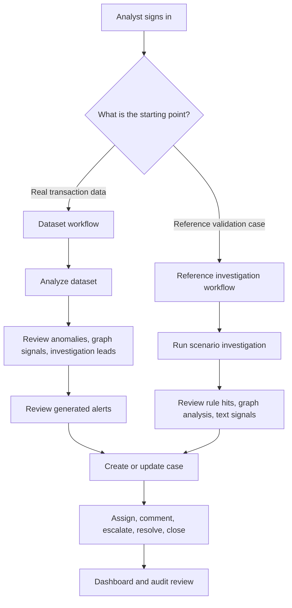
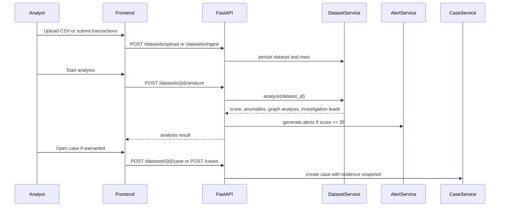
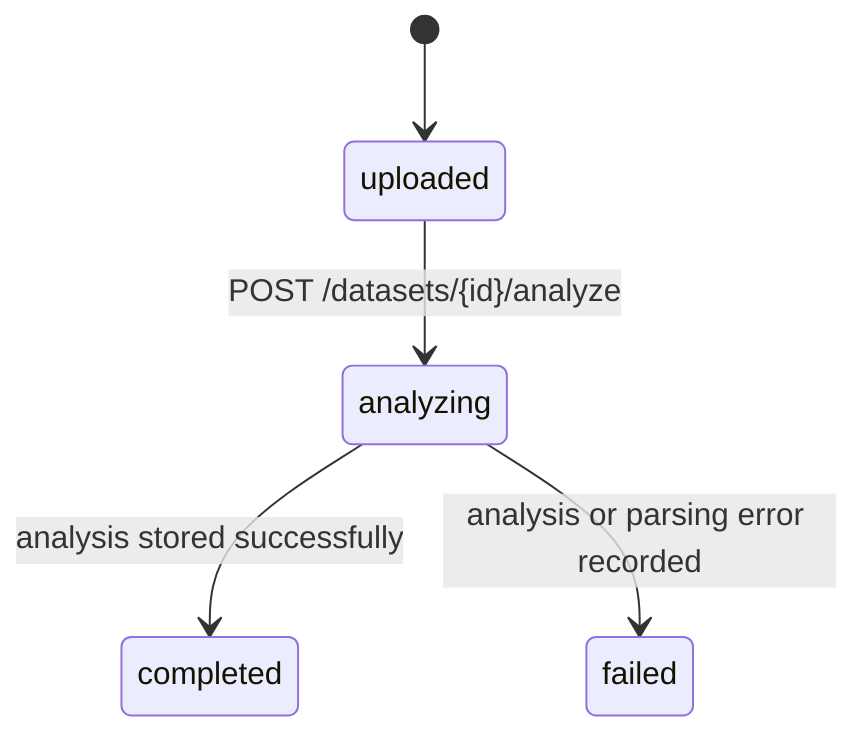
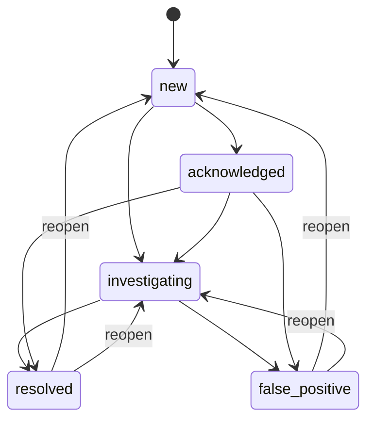
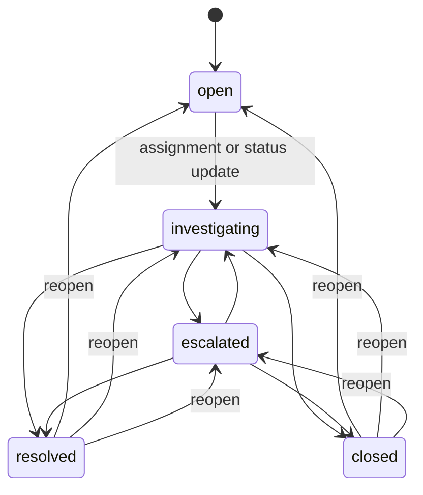
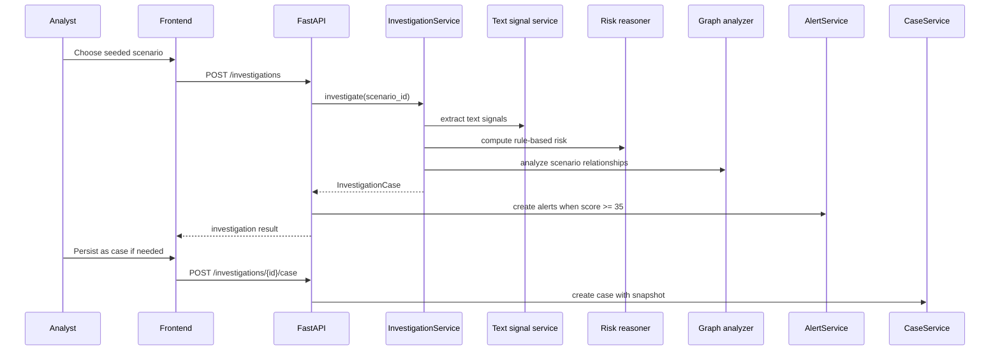
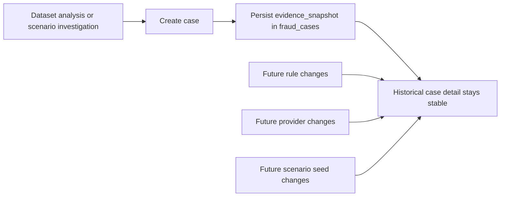

# Workflows

This document explains the operational workflow: how analysts move from uploaded data to alert triage and cases, how reference scenarios fit into the platform, and how lifecycle states behave.

For the system and deployment view, read [architecture.md](architecture.md).

## Workflow map

## Primary product workflow: dataset first

The normal operator journey starts with real transaction data.

### Step 1: ingest data

Operators can:

- upload a CSV through `POST /datasets/upload`
- ingest a JSON payload through `POST /datasets/ingest`

Each dataset persists:

- dataset metadata
- normalized transactions
- status (`uploaded`, `analyzing`, `completed`, `failed`)

### Step 2: analyze the dataset

`POST /datasets/{id}/analyze` runs:

- Benford analysis
- statistical outlier detection
- velocity spike detection
- round-amount detection
- behavioral analysis across accounts, merchants, devices, and geographies

The result includes:

- overall risk score and risk level
- anomaly flags
- graph analysis summary
- investigation leads
- human-readable summary

### Step 3: alert generation

If the resulting score is `>= 35`, the platform creates up to three alerts from the strongest findings for that dataset source.

### Step 4: create or update a case

Analysts can open a case directly from:

- a dataset analysis
- an alert
- a scenario investigation
- the generic `POST /cases` endpoint

When the case is created, the platform stores an evidence snapshot so later changes in rules or providers do not rewrite the historical case.

### Step 5: triage and disposition

Cases and alerts then move through their own lifecycle states while the dashboard and audit trail reflect the work.

## Dataset workflow sequence

## Dataset state model

## Alert lifecycle

Alerts are persistent queue items. They can be linked to cases and reopened after terminal states.

Operational notes:

- `acknowledged_at` is set when an alert is first acknowledged
- `resolved_at` is set when an alert reaches `resolved` or `false-positive`
- reopening clears stale terminal timestamps so status and timestamps stay consistent

## Case lifecycle

Cases are the durable investigation record. Assignment can move an `open` case into `investigating`, and reopening clears resolution metadata.

Operational notes:

- `priority` defaults from risk level unless explicitly provided
- high and critical cases get shorter SLA deadlines
- moving out of `resolved` or `closed` clears disposition, resolution notes, and `resolved_at`
- case comments increment a persisted `comment_count`
- linked alerts are tracked through a persisted `alert_count`

## Reference investigation workflow

Reference scenarios are useful for rule validation, demos, graph testing, and deterministic fraud narratives. They are not the main data-entry path.

## Evidence durability workflow

This is the project rule that protects historical integrity.

Without this rule, old cases would drift as the codebase evolved. The current implementation avoids that.

## Role-based view of the workflow

| Role | Primary concern | Most used areas |
|------|-----------------|-----------------|
| Analyst | Turn risky data into a durable case quickly | datasets, alerts, cases |
| Queue owner | Keep alert backlog moving and close false positives fast | alerts, cases, dashboard |
| Admin | Verify platform health, traceability, and operator activity | dashboard, audit events, health |

## Endpoint map by workflow stage

| Stage | Endpoints | Outcome |
|------|-----------|---------|
| Authenticate | `POST /auth/token`, `GET /auth/me` | establish operator session |
| Learn workflow | `GET /workspace/guide` | fetch role-aware workflow guidance |
| Ingest data | `POST /datasets/upload`, `POST /datasets/ingest`, `GET /datasets` | create and inspect datasets |
| Analyze data | `POST /datasets/{id}/analyze`, `GET /datasets/{id}/analysis`, `GET /datasets/{id}/explanation` | score dataset and fetch explanation |
| Investigate scenarios | `GET /scenarios`, `GET /scenarios/{id}`, `POST /investigations` | run reference investigation |
| Work alerts | `GET /alerts`, `PATCH /alerts/{id}`, `POST /alerts/{id}/case` | triage alert queue and open cases |
| Work cases | `POST /cases`, `GET /cases`, `GET /cases/{id}`, `PATCH /cases/{id}/status`, `POST /cases/{id}/comments`, `POST /datasets/{id}/case`, `POST /investigations/{id}/case` | create and manage durable investigations |
| Monitor platform | `GET /dashboard/stats`, `GET /audit-events`, `GET /health` | observe queue health, audit trail, and runtime posture |

## Guardrails worth keeping

- Alert thresholds stay fixed regardless of provider mode.
- The explanation layer never decides workflow state on its own.
- Dataset analysis remains the main operator path.
- Historical cases must always read from stored evidence snapshots.
